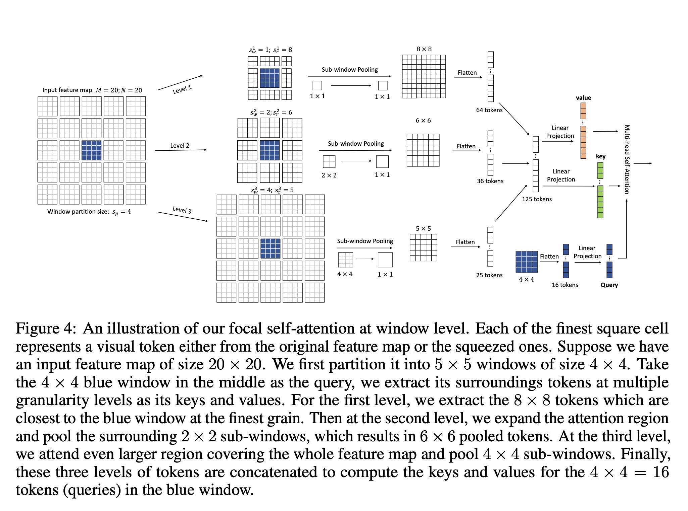
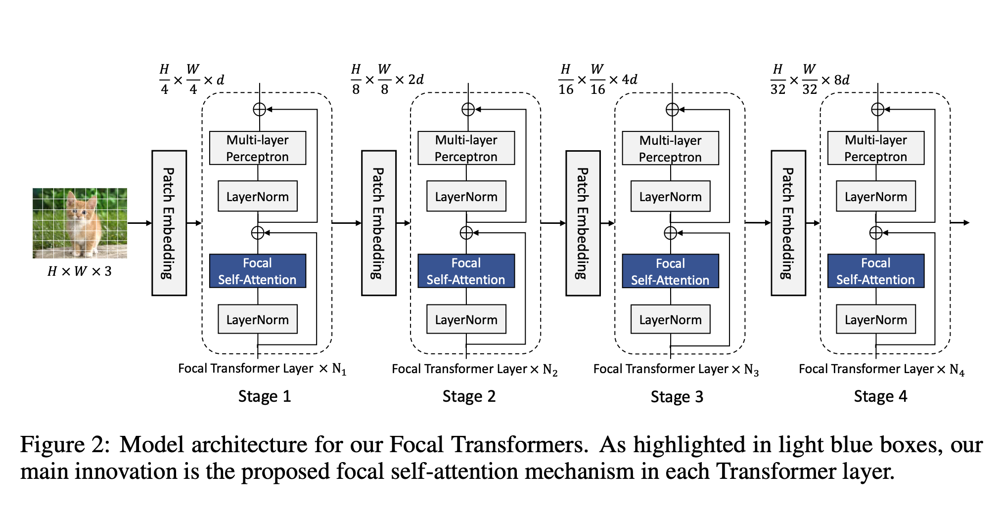
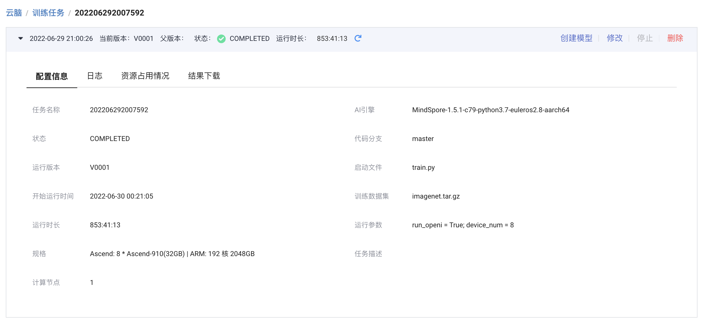
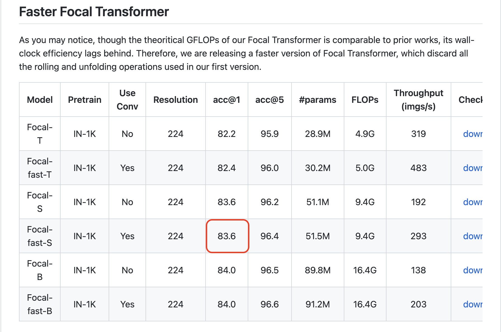
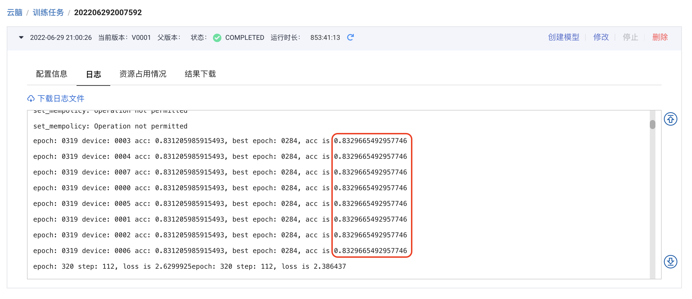

## Focal Transformer 模型自验报告

> 林丽森 finder4alex@163.com


## 1. 模型简介

### 1.1 网络模型结构简介

借助自注意力捕获短程和长程视觉依赖的能力，使得 `Vision Transformer` 及其变体在各种计算机视觉任务中显示出巨大的潜力，但由于二次计算开销问题，此类网络仍然面临较大挑战，尤其是对于高分辨率视觉任务（例如，目标检测）。

在`Focal Transformer`中，作者提出了`focal self-attention`，这是一种结合细粒度局部和粗粒度全局交互的新机制。使用这种新机制，每个标记以细粒度关注最近的周围标记，但以粗粒度关注远离的标记，因此可以高效且有效地捕获短程和长程视觉依赖。具体描述参见下图。



通过采用`focal self-attention`结构，文中提出了一种新的`Vision Transformer`模型变体，称为`Focal Transformer`，它在一系列公共图像分类和目标检测基准上实现了优于最先进的`Vision Transformer`的性能。详细网络结构参加下图。




### 1.2 数据集

> 所用数据集地址：https://git.openi.org.cn/kaierlong/imagenet2012_whole/datasets

使用训练及测试数据集如下：

```shell
使用的数据集：ImageNet2012

数据集大小：共1000个类、224*224彩色图像
训练集：共1,281,167张图像
测试集：共50,000张图像
数据格式：JPEG
注：数据在dataset.py中处理。
下载数据集，目录结构如下：
└─dataset
   ├─train                 # 训练数据集
   └─val                   # 评估数据集
```


### 1.3 代码提交地址

暂时提交在启智中，私有未开源。

仓库地址如下：https://git.openi.org.cn/finder4alex/Focal-Transformer.git


## 2. 代码目录结构说明

代码目录结构及说明如下：

```shell
.
├── LICENSE
├── README.md			// 说明文档
├── README_CN.md	// 
├── eval.py				//
├── image					// 
├── src
│   ├── args.py
│   ├── configs		// 超参数配置目录
│   │   ├── focalv2_small_useconv_patch4_window7_224.yaml
│   │   ├── focalv2_tiny_useconv_patch4_window7_224.yaml
│   │   └── parser.py
│   ├── data			// 数据加载及处理目录
│   │   ├── __init__.py
│   │   ├── augment
│   │   │   ├── __init__.py
│   │   │   ├── auto_augment.py
│   │   │   ├── custom_transforms.py
│   │   │   ├── mixup.py
│   │   │   └── random_erasing.py
│   │   ├── data_utils
│   │   │   ├── __init__.py
│   │   │   └── moxing_adapter.py
│   │   └── imagenet.py
│   ├── models		// 网络结构目录
│   │   ├── __init__.py
│   │   └── focal_transformer
│   │       ├── __init__.py
│   │       ├── focal_transformer_v2.py				// 1.5.1版本支持
│   │       ├── focal_transformer_v2_high.py	// 1.6.0及以上版本支持
│   │       ├── get_focal_transformer.py
│   │       └── misc.py
│   ├── tools			// 相关工具目录
│   │   ├── __init__.py
│   │   ├── callback.py
│   │   ├── cell.py
│   │   ├── criterion.py
│   │   ├── get_misc.py
│   │   ├── optimizer.py
│   │   └── schedulers.py
│   └── trainers	// 训练优化目录
│       ├── __init__.py
│       ├── model_ema.py
│       ├── train_one_step_with_ema.py
│       └── train_one_step_with_scale_and_clip_global_norm.py
└── train.py			// 训练文件
```


## 3. 自验结果（交付精度规格时需要补齐）

### 3.1 自验环境

软硬件环境如下：

- 启智AI引擎：MindSpore-1.5.1-c79-python3.7-euleros2.8-aarch64
- Ascend: 8 * Ascend-910(32GB) | ARM: 192 核 2048GB


**详细环境配置参见下图：**




### 3.2 训练超参数

超参数配置如下：

> 其中data_url由启智平台实际数据地址替换，训练时替换。

```yaml
# Architecture
arch: focalv2_small_useconv_patch4_window7_224

# ===== Dataset ===== #
data_url: ./data/imagenet
set: ImageNet
num_classes: 1000
mix_up: 0.8
cutmix: 1.0
auto_augment: rand-m9-mstd0.5-inc1
interpolation: bicubic
re_prob: 0.25
re_mode: pixel
re_count: 1
mixup_prob: 1.
switch_prob: 0.5
mixup_mode: batch
crop_ratio: 0.875


# ===== Learning Rate Policy ======== #
optimizer: adamw
lr_scheduler: cosine_lr
base_lr: 0.0005
min_lr: 0.000005
warmup_length: 20
warmup_lr: 0.00001
cool_length: 20
cool_lr: 0.000005


# ===== Network training config ===== #
amp_level: O1
keep_bn_fp32: True
beta: [ 0.9, 0.999 ]
is_dynamic_loss_scale: True
use_global_norm: True
clip_global_norm_value: 5.
enable_ema: True
ema_decay: 0.99992
loss_scale: 1024
weight_decay: 0.05
momentum: 0.9
label_smoothing: 0.1
epochs: 320
batch_size: 64


# ===== Hardware setup ===== #
num_parallel_workers: 16
device_target: Ascend

# ===== Model config ===== #
image_size: 224
patch_size: 4
drop_path_rate: 0.3
embed_dim: 96
depths: [ 2, 2, 18, 2 ]
num_heads: [ 3, 6, 12, 24 ]
window_size: 7
focal_stages: [ 0, 1, 2, 3 ]
focal_levels: [ 2, 2, 2, 2 ]
focal_windows: [ 7, 5, 3, 1 ]
expand_sizes: [ 3, 3, 3, 3 ]
focal_topK: 128
focal_pool: "fc"
```


### 3.3 训练

### 3.3.1 如何启动训练脚本

训练如何启动：

- 启智平台

模型训练在启智平台完成，完整训练配置如下图所示：


- 本地命令

**如果需要本地训练，可以使用如下命令：**

```shell
python3 train.py --run_openi=True --arch=focalv2_small_useconv_patch4_window7_224 --device_num=8
```


#### 3.3.2 训练精度结果

- 论文精度如下:



- 复现精度如下：



- 精度结果对比

  - 论文精度为：83.6
- 复现精度为：83.296（最优值）
- 复现精度误差为：(83.6 - 83.296) / 83.6 ≈ 0.36%


### 3.4 模型推理

推理命令如下：

```shell
python3 eval.py --config=src/configs/focalv2_small_useconv_patch4_window7_224.yaml --pretrained={ckpt_path} --device_id={device_id} --device_target={device_target} --data_url={data_url}
```


## 4. 参考资料

### 4.1 参考论文

- [Focal Self-attention for Local-Global Interactions in Vision Transformers](https://arxiv.org/abs/2107.00641)


### 4.2 参考git项目

- [microsoft/Focal-Transformer](https://github.com/microsoft/Focal-Transformer)


### 4.3 参考文献

- [新注意力！Focal Transformer：ViT中局部-全局交互的Focal自注意力](https://zhuanlan.zhihu.com/p/386606514)
